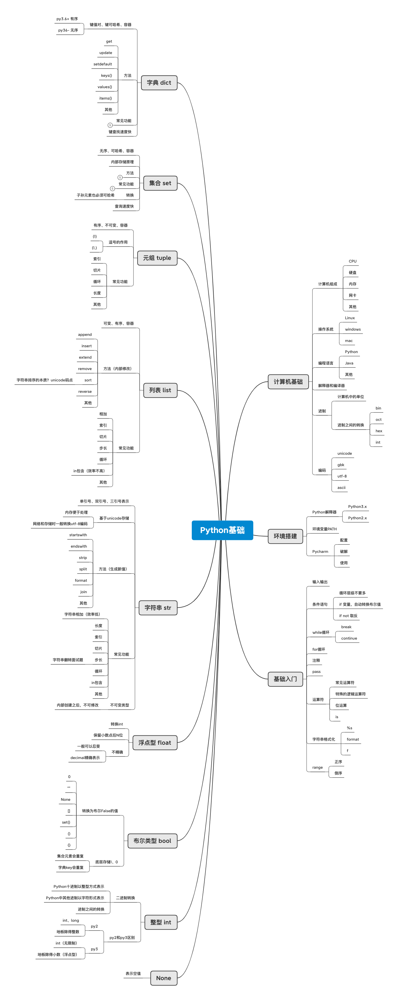

# Python基础

## 计算机基础

### 计算机组成

- CPU
- 硬盘
- 内存
- 网卡
- 其他

### 操作系统

- Linux
- windows
- mac

### 编程语言

- Python
- Java
- 其他

### 解释器和编译器

### 进制

- 计算机中的单位
- 进制之间的转换

	- bin
	- oct
	- hex
	- int

### 编码

- unicode
- gbk
- utf-8
- ascii

## 环境搭建

### Python解释器

- Python3.x
- Python2.x

### 环境变量PATH

### Pycharm

- 配置
- 破解
- 使用

## 基础入门

### 输入输出

### 条件语句

- 循环层级不要多
- if 变量，自动转换布尔值
- if not 取反

### while循环

- break
- continue

### for循环

### 注释

### pass

### 运算符

- 常见运算符
- 特殊的逻辑运算符
- 位运算
- is

### 字符串格式化

- %s
- format
- f

### range

- 正序
- 倒序

## None

### 表示空值

## 整型 int

### 二进制转换

- Python十进制以整型方式表示
- Python中其他进制以字符形式表示
- 进制之间的转换

### py2和py3区别

- py2

	- int、long
	- 地板除得整数

- py3

	- int（无限制）
	- 地板除得小数（浮点型）

## 布尔类型 bool

### 转换为布尔False的值

- 0
- “”
- None
- []
- set()
- ()
- {}

### 底层存储1、0

- 集合元素会重复
- 字典key会重复

## 浮点型 float

### 转换int

### 保留小数点后N位

### 不精确

- 一般可以忍受
- decimal精确表示

## 字符串 str

### 单引号、双引号、三引号表示

### 基于unicode存储

- 内存便于处理
- 网络和存储时一般转换utf-8编码

### 方法（生成新值）

- startswith
- endswith
- strip
- split
- format
- join
- 其他

### 常见功能

- 字符串相加（效率低）
- 长度
- 索引
- 切片
- 步长

	- 字符串翻转面试题

- 循环
- in包含
- 其他

### 不可变类型

- 内部创建之后，不可修改

## 列表 list

### 可变、有序、容器

### 方法（内部修改）

- append
- insert
- extend
- remove
- sort

	- 字符串排序的本质？unicode码点

- reverse
- 其他

### 常见功能

- 相加
- 索引
- 切片
- 步长
- 循环
- in包含（效率不高）
- 其他

## 元组 tuple

### 有序、不可变、容器

### 逗号的作用

- (1)
- (1,)

### 常见功能

- 索引
- 切片
- 循环
- 长度
- 其他

## 集合 set

### 无序、可哈希、容器

### 内部存储原理

### 方法

- add
- discard
- intersection
- union
- difference

### 常见功能

- 长度
- -
- &
- |
- 循环

### 转换

- 子孙元素也必须可哈希

### 查询速度快

## 字典 dict

### 键值对、键可哈希、容器

- py3.6+ 有序
- py36- 无序

### 方法

- get
- update
- setdefault
- keys()
- values()
- items()
- 其他

### 常见功能

- | 运算

	- py3.9 + 

- 长度
- 索引（key）
- 循环

### 键查找速度快

