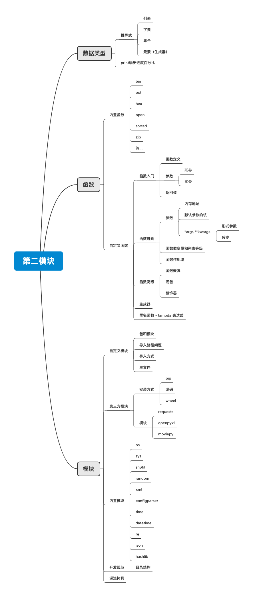

# 第二模块

## 数据类型

### 推导式

- 列表
- 字典
- 集合
- 元素（生成器）

### print输出进度百分比

## 函数

### 内置函数

- bin
- oct
- hex
- open
- sorted
- zip
- 等...

### 自定义函数

- 函数入门

	- 函数定义
	- 参数

		- 形参
		- 实参

	- 返回值

- 函数进阶

	- 参数

		- 内存地址
		- 默认参数的坑
		- *args,**kwargs

			- 形式参数
			- 传参

	- 函数做变量和列表等级
	- 函数作用域

- 函数高级

	- 函数嵌套
	- 闭包
	- 装饰器

- 生成器
- 匿名函数 - lambda 表达式

## 模块

### 自定义模块

- 包和模块
- 导入路径问题
- 导入方式
- 主文件

### 第三方模块

- 安装方式

	- pip
	- 源码
	- wheel

- 模块

	- requests
	- openpyxl
	- moviepy

### 内置模块

- os
- sys
- shutil
- random
- xml
- configparser
- time
- datetime
- re
- json
- hashlib

### 开发规范

- 目录结构

### 深浅拷贝

